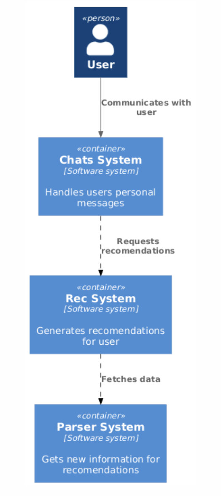
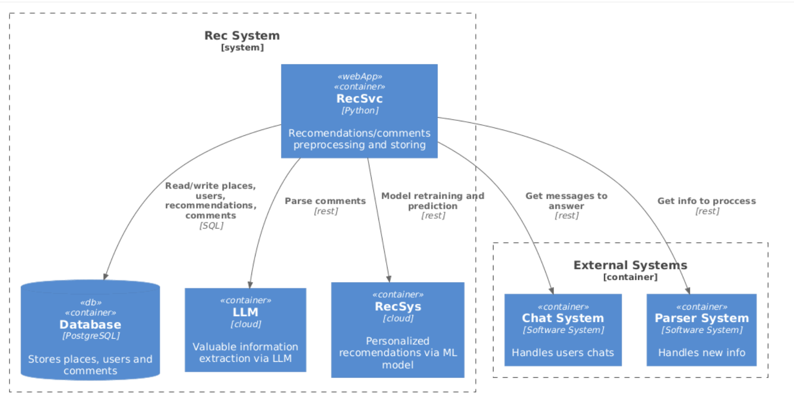

# Диалоговая система для персонализированных мест отдыха

## Функциональные требования
- Получение персонализированных рекомендаций пользователем
- Оставление собственных рекомендаций

## Нефункциональные требования
- DAU 10000
- Доступность 95%
- Данные храним всегда
- Сезонность есть: период отпусков и праздники, множитель на использование бота в 2 раза на этот период
- Аудитория: страны СНГ
- Активность пользователей:
- Пользователь в среднем оставляет 1 рекомендацию в день
- Пользователь в среднем просит 3 рекомендации в день
- Лимиты:
    - 4096 символов – длина стандартного сообщения в телеграмме
- Тайминги:
    - Ответ на запрос пользователя – 5с
- RPS
    - Чтение(получение рекомендаций):  (10000 * 3) / 86400 = 0,33
    - Запись(оставление собственной рекомендации): (10000 * 3) / 86400 = 0,11

## Архитектура

     <b>Level 1.</b> System context diagram  

  

     <b>Level 2.</b> Chat system container diagram  

 

  

     <b>Level 2.</b> Parser system container diagram  

 

  

     <b>Level 2.</b> Rec system container diagram  

 

  

